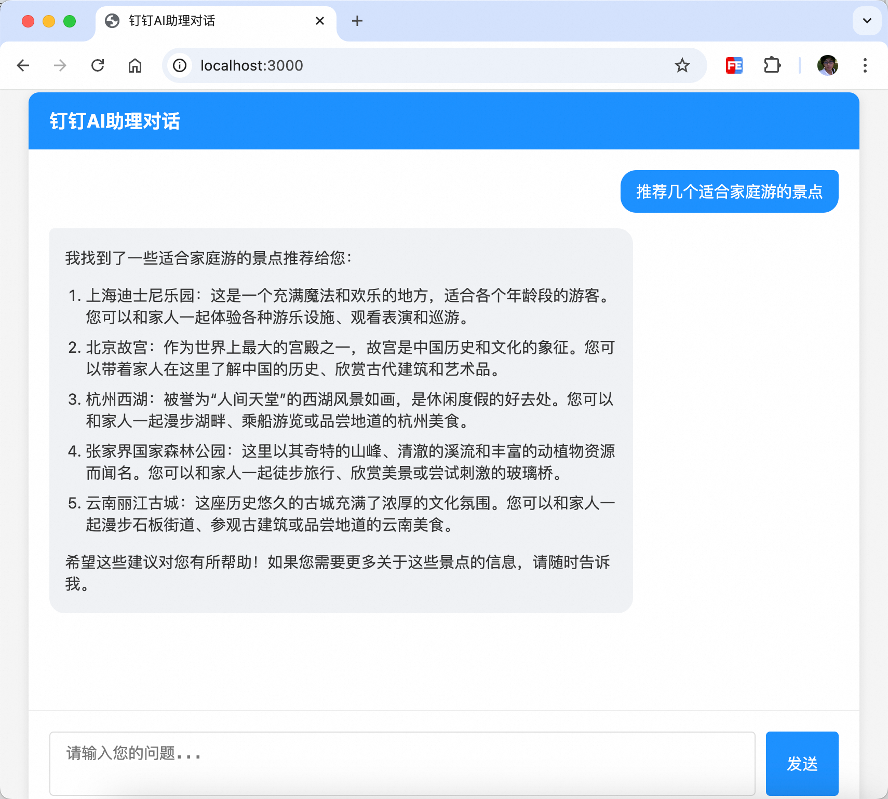

# 钉钉AI助理API演示项目

这是一个基于钉钉开放平台AI助理API（ [钉钉Assistant API](https://open.dingtalk.com/document/orgapp/assistantapi-call-process) ）的演示项目，提供了一个简单的Web界面与钉钉AI助理进行对话交互。项目采用Node.js后端和原生JavaScript前端实现，支持流式对话响应。



## 功能特性

- 基于WebSocket的实时对话交互
- 支持流式响应，打字机效果显示AI回复
- Markdown格式支持，包括代码高亮
- 简洁现代的用户界面
- 多用户会话管理

## 环境要求

- Node.js 14.0+
- npm 或 yarn

## 快速开始

### 1. 克隆项目

```bash
git clone https://github.com/your-username/dingtalk-assistant-api-demo.git
cd dingtalk-assistant-api-demo
```

### 2. 安装依赖

```bash
npm install
# 或
yarn install
```

### 3. 配置环境变量

在项目根目录创建`.env`文件，参考`.env.example`添加以下配置：

```
# 钉钉AI助理API环境变量
API_BASE_URL=https://api.dingtalk.com/v1.0
ASSISTANT_ID=你的助理ID
CLIENT_ID=你的应用AppKey
CLIENT_SECRET=你的应用AppSecret
PORT=3000
```

> **注意**：您需要在[钉钉开放平台](https://open.dingtalk.com/)创建应用并开通AI助理能力，获取相关的AppKey、AppSecret和助理ID。

### 4. 启动服务

```bash
npm start
# 或
yarn start
```

启动成功后，访问 http://localhost:3000 即可使用AI助理对话功能。

## 项目结构

```
dingtalk-assistant-api-demo/
├── public/                 # 前端静态文件
│   └── index.html          # 前端页面
├── .env                    # 环境变量配置（需自行创建）
├── assistant.js            # 钉钉AI助理API封装类
├── package.json            # 项目依赖配置
├── server.js               # 服务器入口文件
└── README.md               # 项目说明文档
```

## 使用说明

1. 打开浏览器访问 http://localhost:3000
2. 在输入框中输入您的问题
3. 点击发送按钮或按Enter键发送消息
4. AI助理将实时回复您的问题

## API说明

项目中的`assistant.js`封装了钉钉AI助理API的主要功能：

- `getAccessToken()` - 获取钉钉开放平台访问令牌
- `createThread()` - 创建对话线程
- `createMessage(threadId, content)` - 发送用户消息
- `startStreamConversation(threadId, onContent, onEnd)` - 启动流式对话

## 常见问题

1. **无法获取访问令牌**
   - 检查`.env`文件中的`CLIENT_ID`和`CLIENT_SECRET`是否正确
   - 确认应用是否已在钉钉开放平台正确创建并审核通过

2. **无法创建对话线程**
   - 确认`.env`文件中的`API_BASE_URL`是否正确
   - 检查网络连接是否正常

3. **AI助理不回复消息**
   - 确认`.env`文件中的`ASSISTANT_ID`是否正确
   - 检查应用是否已开通AI助理能力

## 贡献指南

如果您想为本项目做出贡献，请遵循以下步骤：

1. Fork本仓库
2. 创建您的特性分支 (`git checkout -b feature/AmazingFeature`)
3. 提交您的更改 (`git commit -m 'Add some AmazingFeature'`)
4. 推送到分支 (`git push origin feature/AmazingFeature`)
5. 开启一个Pull Request

## 许可证

本项目采用MIT许可证 - 详情请参阅 [LICENSE](LICENSE) 文件。

## 致谢

- [钉钉开放平台](https://open.dingtalk.com/)
- [Socket.IO](https://socket.io/)
- [Express](https://expressjs.com/)
- [Marked.js](https://marked.js.org/)
- [Highlight.js](https://highlightjs.org/) 